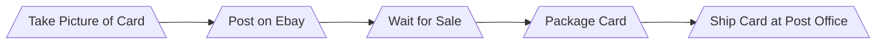

## How to Sell Singular Pokemon Cards Online

**Step 1:** When you take pictures of the card you plan on selling, make sure you use an extremely high definition camera and good lighting. Being able to see the condition of the card through a computer or phone screen will drastically improve the time it will take to sell or the price at which you would like to sell it.

**Step 2:** Post on Ebay, or any trusted online marketplace. When you make your onlne post, be sure to include the entire name of the card including the set number in the bottom left hand corner, so buyers know which exact card it is. Some cards from different sets have identical artwork which makes it hard to determine if your buying what you are looking for.

**Step 3:** Wait for Sale. Check Daily for any updates as buyers that recieve fast replies tend to leave positive reviews.

**Step 4:** Package Card. Packaging singles can be very tricky depending on how much money the card is worth. First thing you must do is make sure the card itself is inside a loose penny sleeve. Once that is done you insert the penny sleeve into a thicker, and much larger sleeve called a TopLoader. Now, you place two identical pieces of cardboard on both sides of the toploader and then secure with multiple rubber bands.

**Step 5:** Print the shipping label and travel to the nearest post office where you will ship the card to the buyer.
     
    
     

