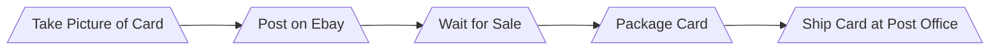

## How to Sell Singular Pokemon Cards Online

**Step 1:** When you take pictures of the card you plan on selling, make sure you use an extremely high definition camera and good lighting. Being able to see the condition of the card through a computer or phone screen will drastically improve the time it will take to sell or the price at which you would like to sell it.

**Step2:**
     
    
     

