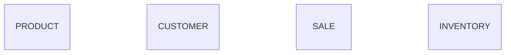

### Entities
     Product: Represents a product that can be bought.
     Customer: Represents customer in the system
     Sale: Represents transaction between customer and product.
     Inventory: Represents the stock of product.
